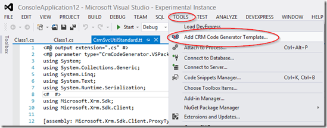
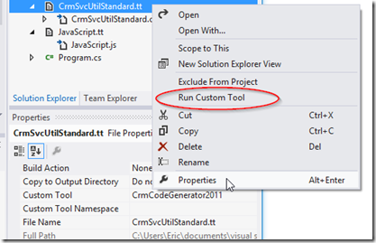

# Dynamics CRM Code Generator for Visual Studio

Visual Studio extension that will generated the early bound classes for for Microsoft Dynamics CRM 2011 / CRM 2013 / CRM 2015 / CRM 2016 / Dynamics 365.   Very Similar to what the CrmSvcUtil.exe does, which is also provided in the CRM Developer Toolkit as the “Generate Wrapper” function.

### Benefits of using this tool over the standard tool

Control which entities to generate classes for
This will keep the size of the generated code to a minimum.  If you use the CrmSvcUtil.exe to generate, the code file will be 200,000 lines.   Compared ~1000 lines for each entity you select.

### Customize the way the code is generated
You get a default T4 template for the code that gets generated.  This will give you full control how the code gets generated.

### Built for Visual Studio
You never have to leave Visual Studio to regenerate the early bound classes.   All the configurations* are stored in the .SLN of the solution which allows you save them to Source Control.  This is very helpful if you are working with other developers.  (*username & password are stored in the .SUO file,  which typically isn’t checked into Source Control)

The Developer Toolkit does allow you to stay inside Visual Studio but it wont allow you change connection settings  while in Visual Studio.  You have to exit Visual Studio, delete your .SUO file then restart Visual Studio.

## How To Use
Install the VS extension –> [Latest](https://github.com/xairrick/CrmCodeGenerator/raw/master/CrmCodeGenerator.VSPackage/bin/Debug/CrmCodeGenerator.vsix)  
or get from Visual Stuido Marketplace -> https://marketplace.visualstudio.com/vsgallery/4d8db67c-66e9-4b30-bab9-a7f7d8b576b5

#### Add a template to your project

Highlight the project where you want to store the template and generated code.   
Tools –> Add CRM Code Generator Template...  (if you don’t see this menu, then shutdwon visual studio and reinstall the extension)

Start with one of the provided templates

- **CrmSvcUtil.tt** – Code generated from this will be exactly what is produced from CRmSvcUtil.exe
- **CrmSvcUtilExtended.tt** – Adds fieldname & Option Sets values  (used v2 instead)
- **CrmSvcUtilExtendedV2.tt** – Adds enum properties for all Two Option and Option Set fields (this is the one I use)
- **JavaScript.tt** – Example of how to generate a JavaScript file from the CRM Schema (from https://crm2011codegen.codeplex.com )
- **CSharp.tt** – POCO example of how to put C# data annotation on the fields.  (requires you to put a reference to  System.ComponentModel.DataAnnotations in your project)
Sample.tt – Just another example of how to create a template for C#
Connection & Entities

After a template is added to your project you will be prompted for CRM connection info.  Connection info is saved to the .SLN file (username & password are saved to .SUO).
Pick the entities that you want to include. (NOTE: if you click refresh you must have all the connection information filled out)
Click the “Generate Code” button (this process takes about 45 seconds, but seems like 5 minutes)
When the dialog goes away, it’s done and the generated code is ready to use.
Refreshing metadata from the server

If you make schema changes in CRM and you want to refresh the code,   right click the template and select “Run Custom Tool”

#### Changing the template

When you make changes to the template and save, Visual Studio will automatically attempt to re-generate the code.   HINT: select ‘No’ for fresh entities if you have just made changes in the template and don’t need to refresh from the CRM server, it will be much faster

### History
##### Version 1.15.0.0 Beta
- [UPDATED] added VS2017 support

##### Version 1.0.4.0
- [UPDATED] to Dynamics 365 (aka CRM 8.2)

##### Version 1.0.3.3
- [BUG] Fixed attributes named Id
- [BUG] Fixed attributes name EntityTypeCode
- [BUG] Fixed related entities having the same name as the entity or other fields
- [BUG] Fixed optionset item having lable of 'true' or 'false'

##### Version 1.0.3.1 Beta
- [NEW] CrmSvcUtilExtendedV2 template.  Puts Enums & Fields names inside the Entity class.  New entity properties that will allow Option Sets & Two Option properties to be set/get directly with an Enum (making the code much easier to read).

##### Version 1.0.0.21 Alpha
- [NOTE] compiled on new machine, so it's alpha until more tests can be done
- [BUG] fixed saving properties on solutions.

##### Version 1.0.0.4 Beta
- [UPDATE] Improvement to entity metadata rerieval 
- [UPDATE] option to get unpublished changes

##### Version 1.0.0.3 Beta
- [UPDATED] to Visual Studio 2013 (still works on VS2012)  
- [UPDATED] to CRM 2015

##### Version 0.9.3
- [UPDATE] disabling login form while retrieving data from the server.
- [BUG] Fixed, when you have an existing .tt file on disk but not in the project and you were adding a .tt file with the same name to the project Visual Studio would get set stuck in a loop
- [BUG] Fixed, when an error occurred while refreshing the entities the hourglass cursor would be stuck.

##### Version 0.9.2
- [BUG] Reverted back to modal dialog, as Visual Studio will send control keys (eg backspace, home, end) to text editor window with a modeless dialog.
- [BUG] now showing the wait cursor sooner when logging into CRM to retrieve the entities.
- [UPDATE] updated templates so that they would convert any Carriage Return in descriptions to CRLF

##### Version 0.9.1
- [BUG] fixed bug when existing template window was open in the editor and it was being replaced.
- [UPDATE] changed AddTemplate window to non-modal (Login window has to be modal)
- [BUG] fixed window position to center on Visual Studio
- [BUG] removed connection cache as it may not renew itself (eg leave VS open over night and you wont be able to re-generate code)

##### Version 0.9
CrmSvcUtil.tt is ready for production. All generated classes has been compared to(and match) the Output from CrmSvcUtil.exe
- [UPDATE] added more entities to the list of Non-Standard
- [UPDATE] updated Attributes1 to match naming used by CrmSvcUtil.exe
- [UPDATE] removed double underscore on Event, Namespace, & Abstract attributes to match CrmSvcUtil.exe
- [UPDATE] removed background color on checkbox
- [UPDATE] converted attributes name for SecondHalf & FirstHalf to match the title case used by CrmSvcUtil.exe
- [BUG] fixed name for InvoiceState.Closed
- [REFACTOR] Moved NonStandard entities to helper class
- [UPDATE] Added the ability to exclude the non-standard entities with a checkbox.
- [UPDATE] added summaries to XrmServiceContext class in CrmSvcUtil.tt
- [BUG] fixed false positive on self-referencing many to many relationships (eg CampaignItem  Campaign-to-Campaign is not self-referencing)
- [UPDATE] to only use base.Id on read only entities  (this is a template change if you have an old template delete and use the - one from this version)
- [UPDATE] Dialogs now open in the center of Visual Studio

##### Version 0.8.5
- [UPDATE] XML escaped the descriptions so they can be added into the summary of an class/property
- [UPDATE] force-excluded entities that aren't included in CrmSvcUtil.exe
- [BUG] typo in CrmSvcUtil.tt
- [UPDATE] corrected CalendarRules by mirroring what CrmSvcUtil.exe does
- [UPDATE] added rule to convert attribute name from calendar_calendar_rules to CalendarRules
- [UPDATE] update Attribute type for ManagedProperties (eg ConnectionRole.IsCustomizable)
- [UPDATE] fixed the case on the 'From' attribute
- [UPDATE] excluded some more entities that aren't included with CrmSvcUtil.exe
- [UPDATE] added support deprecated attributes
- [UPDATE] cosmetic changes to CrmSrvUtil template to make it look more like the output from CrmSrvUtil.exe

##### Version 0.8.4.1
- [BUG] Fixed bug in CrmSvcUtil template that cause problem with readonly entities 
 
##### Version 0.8.4
- [BUG] corrected AuditId so that it is now read only attribute on Audit (to match CrmSvcUtil.exe)
- [BUG] corrected the StateCode on the AsyncOperation  entity to allow it to be R/W (to match CrmSvcUtil.exe)
- [BUG] Fixed attribute name for the ID attribute of Activities  (it should be activityid not appoinmentid)
- [BUG] AllParties needed to be made read only.
- [BUG] Proper case for RequiredAttendees
- [BUG] fixed the Attribute names for the period attributes on the fiscal calendars  (now using annual/quarter/month instead of period/periodN/periodN)
- [BUG] fixed attribute name of self-referencing 1:N relationship (eg "account_parent_account")
- [UPDATE] Added ObjectTypeCode to entities that have them (eg address, annotation, queueitem, etc.)
- [REFACTOR] removed the extra code that was added to created the Base fields (it wasn't needed, they were jsut being excluded)
- [BUG] Added fully qualified class name to OptionSetValue
- [UPDATE] Added Entity/Class summary to CrmSvcUtil template
- [UPDATE] Replaced spaces with tabs in the CrmSvcUtil template
- [UPDATE] Replaced all spaces in the CrmSvcUtil template with tabs
- [UPDATE] Added summary to the attributes.

##### Version 0.8.3.3
- [BUG] fixed bug that was allowing a relationship to be updatable when the underlying property was not updatable.
- [UPDATE] Added Referenced/Referencing relationships for self referencing N:N relationships (eg campaigncampaign_association)
- [BUG] changed naming convention on 1:N relationship to match CrmSvcUtil.exe (removed the pluralization)
- [UPDATE] forced removed postregarding, postrole, imagedescriptor, owner as they aren't provide in CrmSvcUtil
- [BUG] Corrected the names of the Self-referencing relationships (eg contact_customer_contacts)
- [UPDATE] Added _Base attributes for currency attributes.  Added some explicit class names

##### Version 0.8.3.2
- [BUG] Possible naming conflict when an N:N relationship has the same name as the entity. (eg native N:N relationship)

##### Version 0.8.3.1
- [BUG] Used the wrong name when mapping related entities for custom entities.  (also requires template to be updated; change attribute.ToEntity.DisplayName to attribute.ToEntity.HybridName)

##### Version 0.8.3
Worked on getting the CrmSvcUtil template to more closely mirror what is generated by CrmScvUtil.exe
- [UPDATE] Added support for N:N Relationships
- [UPDATE] Added Support for N:1 Relationships
- [UPDATE] Added Support for 1:N Relationships
- [UPDATE] forced excluding applicationfile entity, it's not provided with the CrmSvcUtil.exe
- [UPDATE] changed default templates so that CrmSvcUtil is the one that match Microsoft's CrmSvcUtil.exe  and CrmSvcUtilExtended is the one with extra items (enums for OptionSetValue)
- [UPDATE] Added additional fields for Entity Images (to match CrmSvcUtil)
- [BUG/UPDATE] Removed the *Name & *Type fields from standard template.
- [BUG] allowed OwnerId to be writable (needed when creating a new record).
- [UPDATE] more standardization of the CrmSrvUtil.  Removed 'sub'attribute fields
- [BUG/UPDATE] forced excluding these entities; sqlencryptionaudit, subscriptionsyncinfo, and subscriptiontrackingdeletedobject.  As they were not listed in the entities that are retrieved by CrmSvcutil
- [BUG/UPDATE] CrmSvcUtilStandard template updated the StateCode to mirror the CrmSvcUtil where the field is ReadOnly.
- [UPDATE] Added ActivityParty (forced if there is Activity in the entities list)
- [BUG/UPDATE] for the standard template uniqueidentifiers are now being set to Nullable<GUID>.

##### Version 0.8.2
- [UPDATE] saving originally generated code so that is can be re-used if the developer cancels the login process the code generation does wipe out the file
- [REFACTOR] Cleaning up the code in DteHelper
- [UPDATE] Made Intersect Entities (aka Native N:N) readonly in the standard template
- [UPDATE] Changed the default URL to match CRM OnLine
- [BUG] Fixed bug that was causing the setting to get lost (ie not saved in the .SLN)
- [BUG] was defaulting to the last organization that was selected.
- [UPDATE] Better error handling for connection problems
- [BUG] fixed so that the ErrorList window would be cleared of any previous template errors
- [UPDATE] Username & Password (encrypted) now stored in the .SUO file
- [UPDATE] password input is now using a PasswordBox so the password is concealed.

##### Version 0.8.1
- [UPDATE] updated wording of menu item
- [BUG] Template was being added if the developer hit cancel or close.
- [UPDATE] removed Min/Max button from dialogs
- [BUG] Fixed Typo in Dialogbox
- [UPDATE] Leaving Login window until have the mapping is done, so it clear to the developer that it's still working.
- [UPDATE] Any syntax errors in the template will generate an Error and show the Error List

##### Version 0.8.0
Complete overhaul.   Menu item now only add the template with the 'Custom Tool' attached.  The 'Custom Tool'  will then prompt for login credentials